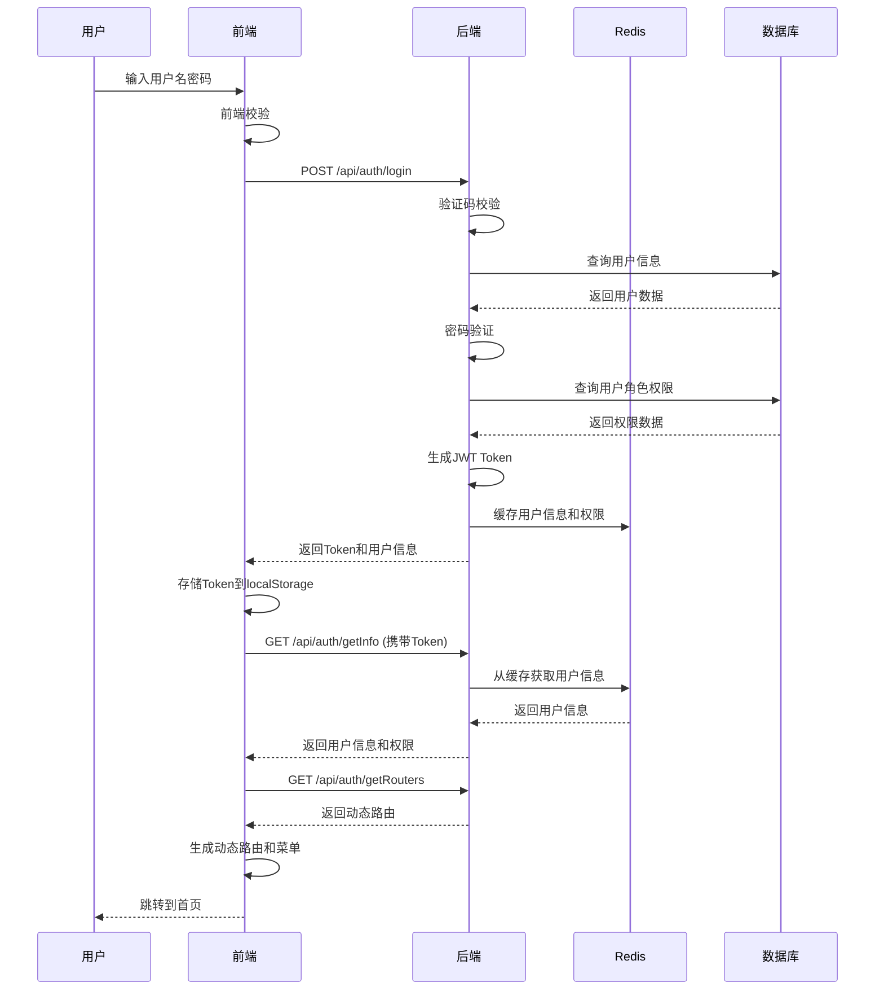
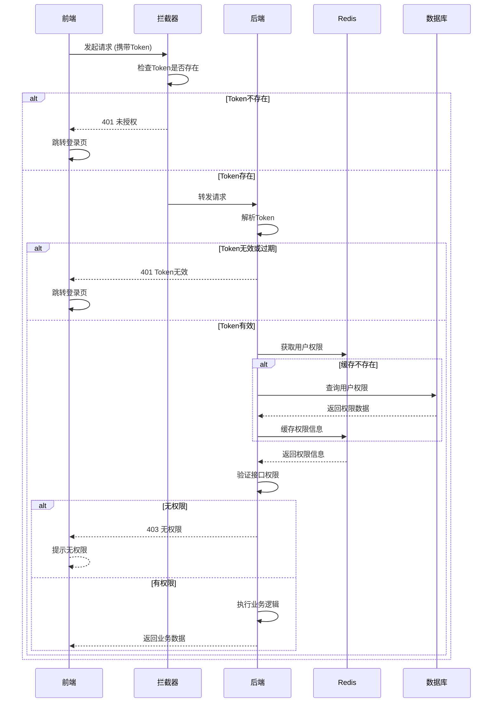
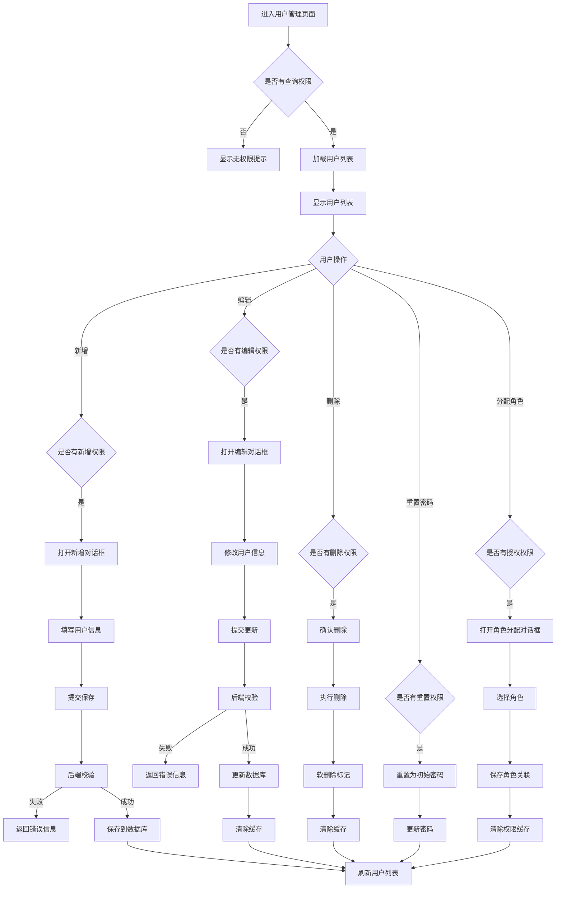
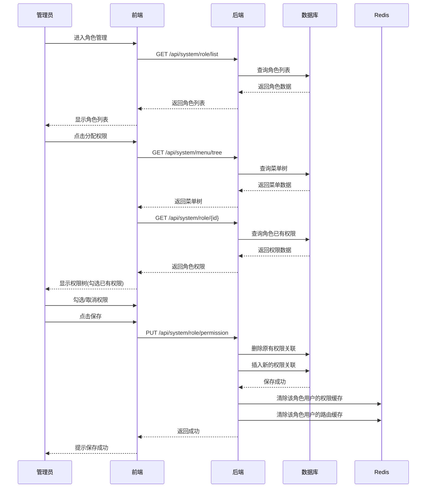
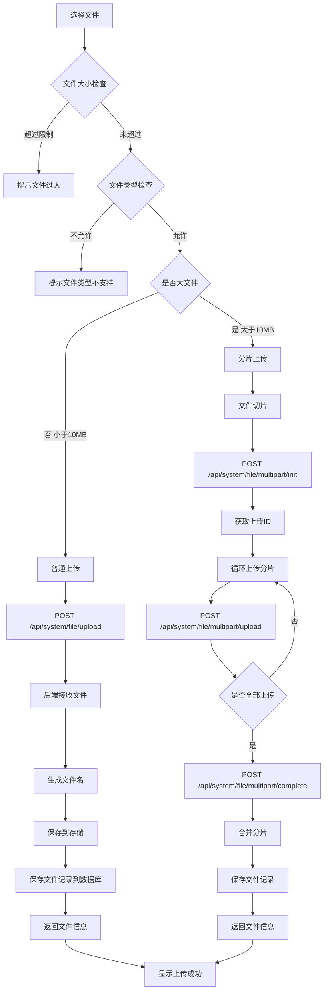
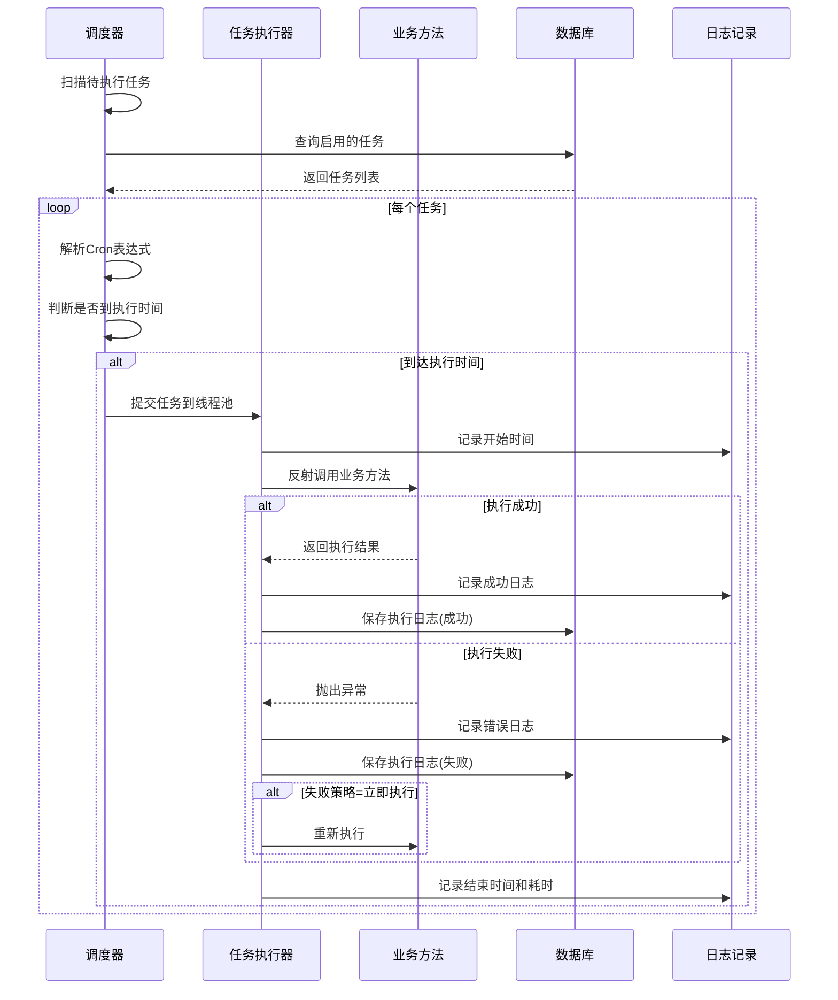
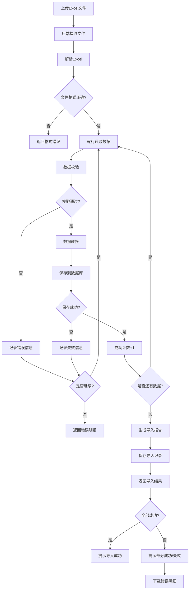

# 系统基座产品需求文档

## 一、项目概述

### 1.1 项目背景
本项目旨在构建一个通用的企业级系统基座，提供用户管理、角色权限、菜单管理、登录认证等基础功能，为业务系统开发提供标准化的底层支撑。

### 1.2 技术选型
- **后端**: Java 1.8 + Spring Boot 2.7.x
- **前端**: Vue 3 + Element Plus
- **数据库**: MySQL 8.0
- **认证方案**: JWT (JSON Web Token)
- **权限框架**: Spring Security + 自定义RBAC
- **ORM框架**: MyBatis Plus
- **API文档**: Knife4j (Swagger增强版)
- **缓存**: Redis
- **日志**: Logback + SLF4J

### 1.3 系统架构
```
┌─────────────────────────────────────────┐
│           前端层 (Vue 3)                 │
│  Element Plus + Vue Router + Pinia      │
└─────────────────────────────────────────┘
                    ↓ HTTP/HTTPS
┌─────────────────────────────────────────┐
│         网关层 (可选)                     │
│         Spring Cloud Gateway            │
└─────────────────────────────────────────┘
                    ↓
┌─────────────────────────────────────────┐
│         应用层 (Spring Boot)             │
│  Controller → Service → Mapper          │
└─────────────────────────────────────────┘
                    ↓
┌──────────────┬──────────────┬───────────┐
│   MySQL      │    Redis     │  其他服务  │
│  (主数据库)   │   (缓存)     │           │
└──────────────┴──────────────┴───────────┘
```

## 二、功能模块设计

### 2.1 用户管理模块

#### 2.1.1 功能描述
管理系统用户的基本信息，包括用户的增删改查、状态管理、密码管理等。

#### 2.1.2 核心功能
- **用户列表**: 分页查询、多条件搜索（用户名、手机号、邮箱、状态）
- **新增用户**: 创建用户账号，设置基本信息和初始密码
- **编辑用户**: 修改用户基本信息
- **删除用户**: 逻辑删除用户（软删除）
- **启用/禁用**: 控制用户账号状态
- **重置密码**: 管理员重置用户密码
- **分配角色**: 为用户分配一个或多个角色

#### 2.1.3 字段设计
- 用户ID (主键)
- 用户名 (唯一)
- 真实姓名
- 手机号 (唯一)
- 邮箱
- 密码 (加密存储)
- 头像URL
- 性别
- 部门ID
- 状态 (启用/禁用)
- 创建时间
- 更新时间
- 创建人
- 更新人
- 删除标记

### 2.2 角色管理模块

#### 2.2.1 功能描述
管理系统角色，实现基于角色的访问控制(RBAC)。

#### 2.2.2 核心功能
- **角色列表**: 分页查询、搜索（角色名称、角色编码）
- **新增角色**: 创建角色，设置角色信息
- **编辑角色**: 修改角色信息
- **删除角色**: 删除角色（需检查是否有用户关联）
- **分配权限**: 为角色分配菜单权限和数据权限
- **角色状态**: 启用/禁用角色

#### 2.2.3 字段设计
- 角色ID (主键)
- 角色名称
- 角色编码 (唯一，如: ROLE_ADMIN)
- 角色描述
- 数据权限范围 (全部/本部门/本部门及下级/仅本人)
- 排序号
- 状态
- 创建时间
- 更新时间
- 删除标记

### 2.3 权限管理模块

#### 2.3.1 功能描述
管理系统的权限资源，包括菜单权限和按钮权限。

#### 2.3.2 核心功能
- **权限列表**: 树形结构展示所有权限
- **新增权限**: 添加菜单或按钮权限
- **编辑权限**: 修改权限信息
- **删除权限**: 删除权限（需检查是否有角色关联）
- **权限类型**: 区分目录、菜单、按钮

#### 2.3.3 字段设计
- 权限ID (主键)
- 父级ID
- 权限名称
- 权限类型 (目录/菜单/按钮)
- 权限标识 (如: sys:user:add)
- 路由路径
- 组件路径
- 图标
- 排序号
- 是否外链
- 是否缓存
- 是否可见
- 状态
- 创建时间
- 更新时间

### 2.4 菜单管理模块

#### 2.4.1 功能描述
管理系统的菜单结构，与权限管理模块结合，控制用户可见的菜单。

#### 2.4.2 核心功能
- **菜单树**: 树形结构展示菜单层级
- **新增菜单**: 添加菜单节点
- **编辑菜单**: 修改菜单信息
- **删除菜单**: 删除菜单节点
- **菜单排序**: 调整菜单显示顺序
- **动态路由**: 根据用户权限动态生成前端路由

#### 2.4.3 菜单类型
- **目录**: 一级菜单，不对应具体页面
- **菜单**: 二级或多级菜单，对应具体页面
- **按钮**: 页面内的操作按钮权限

### 2.5 登录认证模块

#### 2.5.1 功能描述
提供用户登录、登出、Token刷新等认证功能。

#### 2.5.2 核心功能
- **用户登录**:
  - 账号密码登录
  - 验证码校验
  - 登录失败次数限制
  - 登录日志记录
- **Token管理**:
  - JWT Token生成
  - Token刷新机制
  - Token过期处理
- **用户登出**: 清除Token和缓存
- **获取用户信息**: 获取当前登录用户信息和权限
- **修改密码**: 用户修改自己的密码
- **忘记密码**: 通过手机号或邮箱重置密码

#### 2.5.3 安全策略
- 密码加密: BCrypt加密算法
- Token有效期: 2小时
- Refresh Token有效期: 7天
- 登录失败锁定: 5次失败锁定30分钟
- 验证码: 图形验证码，5分钟有效

### 2.6 枚举管理模块

#### 2.6.1 功能描述
统一管理系统中的枚举类型数据，如性别、状态等。

#### 2.6.2 核心功能
- **枚举分类**: 按类型分组管理枚举
- **枚举列表**: 查询枚举项
- **新增枚举**: 添加枚举项
- **编辑枚举**: 修改枚举项
- **删除枚举**: 删除枚举项
- **枚举缓存**: Redis缓存枚举数据

#### 2.6.3 字段设计
- 枚举ID (主键)
- 枚举类型 (如: gender, status)
- 枚举编码
- 枚举值
- 枚举标签
- 排序号
- 状态
- 备注
- 创建时间
- 更新时间

#### 2.6.4 预置枚举类型
- **性别**: 男、女、未知
- **用户状态**: 启用、禁用
- **数据权限**: 全部、本部门、本部门及下级、仅本人
- **菜单类型**: 目录、菜单、按钮
- **操作状态**: 成功、失败
- **通知类型**: 系统通知、业务通知

### 2.7 全局变量管理模块

#### 2.7.1 功能描述
管理系统级别的配置参数，支持动态修改和实时生效。

#### 2.7.2 核心功能
- **参数列表**: 分页查询系统参数
- **新增参数**: 添加配置参数
- **编辑参数**: 修改参数值
- **删除参数**: 删除参数
- **参数缓存**: Redis缓存参数，修改后自动刷新
- **参数分组**: 按功能模块分组

#### 2.7.3 字段设计
- 参数ID (主键)
- 参数名称
- 参数键名 (唯一)
- 参数值
- 参数类型 (字符串/数字/布尔/JSON)
- 参数分组
- 是否系统内置
- 备注
- 创建时间
- 更新时间

#### 2.7.4 预置参数
- 系统名称
- 系统Logo
- 登录页背景
- Token过期时间
- 密码强度要求
- 文件上传大小限制
- 文件上传类型限制

### 2.8 部门管理模块

#### 2.8.1 功能描述
管理组织架构，支持树形结构的部门层级。

#### 2.8.2 核心功能
- **部门树**: 树形结构展示部门
- **新增部门**: 添加部门节点
- **编辑部门**: 修改部门信息
- **删除部门**: 删除部门（需检查是否有用户）
- **部门排序**: 调整部门显示顺序

#### 2.8.3 字段设计
- 部门ID (主键)
- 父级ID
- 部门名称
- 部门编码
- 负责人
- 联系电话
- 邮箱
- 排序号
- 状态
- 创建时间
- 更新时间
- 删除标记

### 2.9 操作日志模块

#### 2.9.1 功能描述
记录用户的操作行为，用于审计和问题追溯。

#### 2.9.2 核心功能
- **日志列表**: 分页查询操作日志
- **日志详情**: 查看操作详细信息
- **日志搜索**: 按用户、模块、时间等条件搜索
- **日志清理**: 定时清理历史日志

#### 2.9.3 字段设计
- 日志ID (主键)
- 操作模块
- 操作类型 (新增/修改/删除/查询)
- 操作描述
- 请求方法
- 请求参数
- 返回结果
- 操作用户
- 操作IP
- 操作地点
- 浏览器
- 操作系统
- 操作状态
- 错误信息
- 操作时间

### 2.10 登录日志模块

#### 2.10.1 功能描述
记录用户登录行为，用于安全审计。

#### 2.10.2 核心功能
- **登录日志列表**: 分页查询登录记录
- **登录统计**: 统计登录次数、在线用户等

#### 2.10.3 字段设计
- 日志ID (主键)
- 用户名
- 登录IP
- 登录地点
- 浏览器
- 操作系统
- 登录状态 (成功/失败)
- 提示信息
- 登录时间

### 2.11 文件管理模块

#### 2.11.1 功能描述
统一管理系统中的文件资源，支持文件上传、下载、预览、删除等操作，支持多种存储方式。

#### 2.11.2 核心功能
- **文件上传**: 支持单文件/多文件上传，支持分片上传大文件
- **文件下载**: 支持文件下载，支持断点续传
- **文件预览**: 支持图片、PDF、Office文档在线预览
- **文件删除**: 逻辑删除文件记录，可配置物理删除策略
- **文件列表**: 分页查询文件，支持按类型、时间筛选
- **存储配置**: 支持本地存储、MinIO、阿里云OSS、腾讯云COS等

#### 2.11.3 字段设计
- 文件ID (主键)
- 文件名称 (原始文件名)
- 文件路径 (存储路径)
- 文件URL (访问地址)
- 文件大小 (字节)
- 文件类型 (MIME类型)
- 文件后缀
- 存储类型 (本地/MinIO/OSS/COS)
- 业务类型 (关联业务模块)
- 业务ID (关联业务数据)
- 上传人
- 上传时间
- 删除标记

#### 2.11.4 文件类型限制
- **图片**: jpg, jpeg, png, gif, bmp, webp
- **文档**: doc, docx, xls, xlsx, ppt, pptx, pdf, txt
- **压缩包**: zip, rar, 7z, tar, gz
- **默认大小限制**: 单文件50MB，可通过系统参数配置

### 2.12 通知公告模块

#### 2.12.1 功能描述
管理系统通知和公告信息，支持定向推送和全员广播。

#### 2.12.2 核心功能
- **公告列表**: 分页查询公告，支持按类型、状态筛选
- **新增公告**: 创建公告，设置标题、内容、类型、接收范围
- **编辑公告**: 修改公告信息
- **删除公告**: 删除公告
- **发布/撤回**: 控制公告发布状态
- **公告阅读**: 记录用户阅读状态
- **消息推送**: 支持站内信、WebSocket实时推送

#### 2.12.3 字段设计
- 公告ID (主键)
- 公告标题
- 公告类型 (通知/公告/消息)
- 公告内容 (富文本)
- 接收范围 (全部/指定部门/指定角色/指定用户)
- 接收对象 (JSON格式存储)
- 优先级 (普通/重要/紧急)
- 发布状态 (草稿/已发布/已撤回)
- 发布人
- 发布时间
- 创建时间
- 更新时间
- 删除标记

#### 2.12.4 公告阅读记录
- 记录ID (主键)
- 公告ID
- 用户ID
- 阅读状态 (未读/已读)
- 阅读时间

### 2.13 在线用户模块

#### 2.13.1 功能描述
监控当前在线用户，支持查看用户会话信息和强制下线操作。

#### 2.13.2 核心功能
- **在线用户列表**: 查询当前在线用户
- **会话详情**: 查看用户登录信息（IP、浏览器、登录时间等）
- **强制下线**: 管理员强制踢出用户
- **批量下线**: 批量踢出用户
- **在线统计**: 统计在线人数、峰值等

#### 2.13.3 会话信息
- 会话ID (Token标识)
- 用户ID
- 用户名
- 部门名称
- 登录IP
- 登录地点
- 浏览器
- 操作系统
- 登录时间
- 最后访问时间

#### 2.13.4 实现方案
- 使用Redis存储用户会话信息
- Token作为Key，会话信息作为Value
- 设置过期时间与Token有效期一致
- 强制下线时删除Redis中的会话记录

### 2.14 定时任务模块

#### 2.14.1 功能描述
管理系统定时任务，支持任务的动态配置、启停和执行日志查看。

#### 2.14.2 核心功能
- **任务列表**: 分页查询定时任务
- **新增任务**: 创建定时任务，配置执行策略
- **编辑任务**: 修改任务配置
- **删除任务**: 删除定时任务
- **启动/暂停**: 控制任务运行状态
- **立即执行**: 手动触发任务执行
- **执行日志**: 查看任务执行历史和结果

#### 2.14.3 任务配置字段
- 任务ID (主键)
- 任务名称
- 任务分组
- 调用目标 (Bean名称.方法名)
- 调用参数 (JSON格式)
- Cron表达式
- 执行策略 (立即执行/放弃执行/执行一次)
- 是否并发 (允许/禁止)
- 任务状态 (运行中/暂停)
- 备注
- 创建时间
- 更新时间

#### 2.14.4 执行日志字段
- 日志ID (主键)
- 任务ID
- 任务名称
- 任务分组
- 调用目标
- 调用参数
- 执行状态 (成功/失败)
- 执行结果
- 错误信息
- 开始时间
- 结束时间
- 执行耗时 (毫秒)

#### 2.14.5 技术实现
- 基于Quartz或XXL-JOB实现
- 支持集群部署，避免重复执行
- 支持任务失败重试和告警通知

### 2.15 数据导入导出模块

#### 2.15.1 功能描述
提供通用的数据导入导出功能，支持Excel格式，支持模板下载和数据校验。

#### 2.15.2 核心功能
- **数据导出**: 将列表数据导出为Excel文件
- **数据导入**: 从Excel文件导入数据
- **模板下载**: 下载导入模板
- **导入校验**: 数据格式和业务规则校验
- **导入结果**: 返回导入成功/失败明细
- **异步导入**: 大数据量异步处理

#### 2.15.3 导入导出配置
- 配置ID (主键)
- 业务模块
- 模板名称
- 模板文件路径
- 字段映射 (JSON格式)
- 校验规则 (JSON格式)
- 是否启用
- 创建时间
- 更新时间

#### 2.15.4 导入记录
- 记录ID (主键)
- 业务模块
- 文件名称
- 文件路径
- 总记录数
- 成功数量
- 失败数量
- 导入状态 (处理中/成功/部分成功/失败)
- 错误明细 (JSON格式)
- 操作人
- 操作时间

#### 2.15.5 技术实现
- 基于EasyExcel实现
- 支持百万级数据导出
- 支持自定义样式和模板
- 支持数据脱敏导出

## 三、数据库设计

### 3.1 表清单
1. `sys_user` - 用户表
2. `sys_role` - 角色表
3. `sys_permission` - 权限表
4. `sys_menu` - 菜单表
5. `sys_user_role` - 用户角色关联表
6. `sys_role_permission` - 角色权限关联表
7. `sys_dept` - 部门表
8. `sys_dict_type` - 字典类型表
9. `sys_dict_data` - 字典数据表
10. `sys_config` - 系统参数表
11. `sys_oper_log` - 操作日志表
12. `sys_login_log` - 登录日志表
13. `sys_file` - 文件表
14. `sys_notice` - 通知公告表
15. `sys_notice_read` - 公告阅读记录表
16. `sys_job` - 定时任务表
17. `sys_job_log` - 任务执行日志表
18. `sys_import_record` - 导入记录表

### 3.2 表关系
```
sys_user ←→ sys_user_role ←→ sys_role
                              ↓
                        sys_role_permission
                              ↓
                        sys_permission (sys_menu)

sys_dept (树形结构，parent_id自关联)
sys_menu (树形结构，parent_id自关联)
sys_dict_type ←→ sys_dict_data
sys_job ←→ sys_job_log
sys_notice ←→ sys_notice_read ←→ sys_user
```

### 3.3 数据库DDL设计

#### 3.3.1 用户表 (sys_user)
```sql
CREATE TABLE sys_user (
    id              BIGINT          NOT NULL AUTO_INCREMENT  COMMENT '用户ID',
    username        VARCHAR(50)     NOT NULL                 COMMENT '用户名',
    password        VARCHAR(100)    NOT NULL                 COMMENT '密码',
    nickname        VARCHAR(50)     DEFAULT ''               COMMENT '昵称',
    email           VARCHAR(100)    DEFAULT ''               COMMENT '邮箱',
    phone           VARCHAR(20)     DEFAULT ''               COMMENT '手机号',
    gender          TINYINT         DEFAULT 0                COMMENT '性别(0未知 1男 2女)',
    avatar          VARCHAR(255)    DEFAULT ''               COMMENT '头像地址',
    dept_id         BIGINT          DEFAULT NULL             COMMENT '部门ID',
    status          TINYINT         DEFAULT 1                COMMENT '状态(0禁用 1正常)',
    login_ip        VARCHAR(50)     DEFAULT ''               COMMENT '最后登录IP',
    login_time      DATETIME        DEFAULT NULL             COMMENT '最后登录时间',
    remark          VARCHAR(500)    DEFAULT ''               COMMENT '备注',
    create_by       VARCHAR(50)     DEFAULT ''               COMMENT '创建者',
    create_time     DATETIME        DEFAULT CURRENT_TIMESTAMP COMMENT '创建时间',
    update_by       VARCHAR(50)     DEFAULT ''               COMMENT '更新者',
    update_time     DATETIME        DEFAULT CURRENT_TIMESTAMP ON UPDATE CURRENT_TIMESTAMP COMMENT '更新时间',
    del_flag        TINYINT         DEFAULT 0                COMMENT '删除标记(0正常 1删除)',
    PRIMARY KEY (id),
    UNIQUE KEY uk_username (username),
    KEY idx_dept_id (dept_id),
    KEY idx_status (status),
    KEY idx_create_time (create_time)
) ENGINE=InnoDB DEFAULT CHARSET=utf8mb4 COLLATE=utf8mb4_unicode_ci COMMENT='用户表';
```

#### 3.3.2 角色表 (sys_role)
```sql
CREATE TABLE sys_role (
    id              BIGINT          NOT NULL AUTO_INCREMENT  COMMENT '角色ID',
    role_name       VARCHAR(50)     NOT NULL                 COMMENT '角色名称',
    role_code       VARCHAR(50)     NOT NULL                 COMMENT '角色编码',
    sort            INT             DEFAULT 0                COMMENT '显示顺序',
    data_scope      TINYINT         DEFAULT 1                COMMENT '数据范围(1全部 2自定义 3本部门 4本部门及以下 5仅本人)',
    status          TINYINT         DEFAULT 1                COMMENT '状态(0禁用 1正常)',
    remark          VARCHAR(500)    DEFAULT ''               COMMENT '备注',
    create_by       VARCHAR(50)     DEFAULT ''               COMMENT '创建者',
    create_time     DATETIME        DEFAULT CURRENT_TIMESTAMP COMMENT '创建时间',
    update_by       VARCHAR(50)     DEFAULT ''               COMMENT '更新者',
    update_time     DATETIME        DEFAULT CURRENT_TIMESTAMP ON UPDATE CURRENT_TIMESTAMP COMMENT '更新时间',
    del_flag        TINYINT         DEFAULT 0                COMMENT '删除标记(0正常 1删除)',
    PRIMARY KEY (id),
    UNIQUE KEY uk_role_code (role_code),
    KEY idx_status (status)
) ENGINE=InnoDB DEFAULT CHARSET=utf8mb4 COLLATE=utf8mb4_unicode_ci COMMENT='角色表';
```

#### 3.3.3 用户角色关联表 (sys_user_role)
```sql
CREATE TABLE sys_user_role (
    user_id         BIGINT          NOT NULL                 COMMENT '用户ID',
    role_id         BIGINT          NOT NULL                 COMMENT '角色ID',
    PRIMARY KEY (user_id, role_id),
    KEY idx_role_id (role_id)
) ENGINE=InnoDB DEFAULT CHARSET=utf8mb4 COLLATE=utf8mb4_unicode_ci COMMENT='用户角色关联表';
```

#### 3.3.4 菜单表 (sys_menu)
```sql
CREATE TABLE sys_menu (
    id              BIGINT          NOT NULL AUTO_INCREMENT  COMMENT '菜单ID',
    menu_name       VARCHAR(50)     NOT NULL                 COMMENT '菜单名称',
    parent_id       BIGINT          DEFAULT 0                COMMENT '父菜单ID',
    sort            INT             DEFAULT 0                COMMENT '显示顺序',
    path            VARCHAR(200)    DEFAULT ''               COMMENT '路由地址',
    component       VARCHAR(255)    DEFAULT ''               COMMENT '组件路径',
    query_param     VARCHAR(255)    DEFAULT ''               COMMENT '路由参数',
    menu_type       CHAR(1)         DEFAULT ''               COMMENT '菜单类型(M目录 C菜单 F按钮)',
    visible         TINYINT         DEFAULT 1                COMMENT '显示状态(0隐藏 1显示)',
    status          TINYINT         DEFAULT 1                COMMENT '状态(0禁用 1正常)',
    perms           VARCHAR(100)    DEFAULT ''               COMMENT '权限标识',
    icon            VARCHAR(100)    DEFAULT '#'              COMMENT '菜单图标',
    remark          VARCHAR(500)    DEFAULT ''               COMMENT '备注',
    create_by       VARCHAR(50)     DEFAULT ''               COMMENT '创建者',
    create_time     DATETIME        DEFAULT CURRENT_TIMESTAMP COMMENT '创建时间',
    update_by       VARCHAR(50)     DEFAULT ''               COMMENT '更新者',
    update_time     DATETIME        DEFAULT CURRENT_TIMESTAMP ON UPDATE CURRENT_TIMESTAMP COMMENT '更新时间',
    PRIMARY KEY (id),
    KEY idx_parent_id (parent_id)
) ENGINE=InnoDB DEFAULT CHARSET=utf8mb4 COLLATE=utf8mb4_unicode_ci COMMENT='菜单表';
```

#### 3.3.5 角色菜单关联表 (sys_role_menu)
```sql
CREATE TABLE sys_role_menu (
    role_id         BIGINT          NOT NULL                 COMMENT '角色ID',
    menu_id         BIGINT          NOT NULL                 COMMENT '菜单ID',
    PRIMARY KEY (role_id, menu_id),
    KEY idx_menu_id (menu_id)
) ENGINE=InnoDB DEFAULT CHARSET=utf8mb4 COLLATE=utf8mb4_unicode_ci COMMENT='角色菜单关联表';
```

#### 3.3.6 部门表 (sys_dept)
```sql
CREATE TABLE sys_dept (
    id              BIGINT          NOT NULL AUTO_INCREMENT  COMMENT '部门ID',
    dept_name       VARCHAR(50)     NOT NULL                 COMMENT '部门名称',
    parent_id       BIGINT          DEFAULT 0                COMMENT '父部门ID',
    ancestors       VARCHAR(500)    DEFAULT ''               COMMENT '祖级列表',
    sort            INT             DEFAULT 0                COMMENT '显示顺序',
    leader          VARCHAR(50)     DEFAULT ''               COMMENT '负责人',
    phone           VARCHAR(20)     DEFAULT ''               COMMENT '联系电话',
    email           VARCHAR(100)    DEFAULT ''               COMMENT '邮箱',
    status          TINYINT         DEFAULT 1                COMMENT '状态(0禁用 1正常)',
    create_by       VARCHAR(50)     DEFAULT ''               COMMENT '创建者',
    create_time     DATETIME        DEFAULT CURRENT_TIMESTAMP COMMENT '创建时间',
    update_by       VARCHAR(50)     DEFAULT ''               COMMENT '更新者',
    update_time     DATETIME        DEFAULT CURRENT_TIMESTAMP ON UPDATE CURRENT_TIMESTAMP COMMENT '更新时间',
    del_flag        TINYINT         DEFAULT 0                COMMENT '删除标记(0正常 1删除)',
    PRIMARY KEY (id),
    KEY idx_parent_id (parent_id)
) ENGINE=InnoDB DEFAULT CHARSET=utf8mb4 COLLATE=utf8mb4_unicode_ci COMMENT='部门表';
```

#### 3.3.7 字典类型表 (sys_dict_type)
```sql
CREATE TABLE sys_dict_type (
    id              BIGINT          NOT NULL AUTO_INCREMENT  COMMENT '字典ID',
    dict_name       VARCHAR(100)    NOT NULL                 COMMENT '字典名称',
    dict_type       VARCHAR(100)    NOT NULL                 COMMENT '字典类型',
    status          TINYINT         DEFAULT 1                COMMENT '状态(0禁用 1正常)',
    remark          VARCHAR(500)    DEFAULT ''               COMMENT '备注',
    create_by       VARCHAR(50)     DEFAULT ''               COMMENT '创建者',
    create_time     DATETIME        DEFAULT CURRENT_TIMESTAMP COMMENT '创建时间',
    update_by       VARCHAR(50)     DEFAULT ''               COMMENT '更新者',
    update_time     DATETIME        DEFAULT CURRENT_TIMESTAMP ON UPDATE CURRENT_TIMESTAMP COMMENT '更新时间',
    PRIMARY KEY (id),
    UNIQUE KEY uk_dict_type (dict_type)
) ENGINE=InnoDB DEFAULT CHARSET=utf8mb4 COLLATE=utf8mb4_unicode_ci COMMENT='字典类型表';
```

#### 3.3.8 字典数据表 (sys_dict_data)
```sql
CREATE TABLE sys_dict_data (
    id              BIGINT          NOT NULL AUTO_INCREMENT  COMMENT '字典数据ID',
    dict_type       VARCHAR(100)    NOT NULL                 COMMENT '字典类型',
    dict_label      VARCHAR(100)    NOT NULL                 COMMENT '字典标签',
    dict_value      VARCHAR(100)    NOT NULL                 COMMENT '字典键值',
    sort            INT             DEFAULT 0                COMMENT '显示顺序',
    css_class       VARCHAR(100)    DEFAULT ''               COMMENT '样式属性',
    list_class      VARCHAR(100)    DEFAULT 'default'        COMMENT '表格回显样式',
    is_default      TINYINT         DEFAULT 0                COMMENT '是否默认(0否 1是)',
    status          TINYINT         DEFAULT 1                COMMENT '状态(0禁用 1正常)',
    remark          VARCHAR(500)    DEFAULT ''               COMMENT '备注',
    create_by       VARCHAR(50)     DEFAULT ''               COMMENT '创建者',
    create_time     DATETIME        DEFAULT CURRENT_TIMESTAMP COMMENT '创建时间',
    update_by       VARCHAR(50)     DEFAULT ''               COMMENT '更新者',
    update_time     DATETIME        DEFAULT CURRENT_TIMESTAMP ON UPDATE CURRENT_TIMESTAMP COMMENT '更新时间',
    PRIMARY KEY (id),
    KEY idx_dict_type (dict_type)
) ENGINE=InnoDB DEFAULT CHARSET=utf8mb4 COLLATE=utf8mb4_unicode_ci COMMENT='字典数据表';
```

#### 3.3.9 系统参数表 (sys_config)
```sql
CREATE TABLE sys_config (
    id              BIGINT          NOT NULL AUTO_INCREMENT  COMMENT '参数ID',
    config_name     VARCHAR(100)    NOT NULL                 COMMENT '参数名称',
    config_key      VARCHAR(100)    NOT NULL                 COMMENT '参数键名',
    config_value    VARCHAR(500)    NOT NULL                 COMMENT '参数键值',
    config_type     TINYINT         DEFAULT 0                COMMENT '系统内置(0否 1是)',
    remark          VARCHAR(500)    DEFAULT ''               COMMENT '备注',
    create_by       VARCHAR(50)     DEFAULT ''               COMMENT '创建者',
    create_time     DATETIME        DEFAULT CURRENT_TIMESTAMP COMMENT '创建时间',
    update_by       VARCHAR(50)     DEFAULT ''               COMMENT '更新者',
    update_time     DATETIME        DEFAULT CURRENT_TIMESTAMP ON UPDATE CURRENT_TIMESTAMP COMMENT '更新时间',
    PRIMARY KEY (id),
    UNIQUE KEY uk_config_key (config_key)
) ENGINE=InnoDB DEFAULT CHARSET=utf8mb4 COLLATE=utf8mb4_unicode_ci COMMENT='系统参数表';
```

#### 3.3.10 操作日志表 (sys_oper_log)
```sql
CREATE TABLE sys_oper_log (
    id              BIGINT          NOT NULL AUTO_INCREMENT  COMMENT '日志ID',
    title           VARCHAR(50)     DEFAULT ''               COMMENT '模块标题',
    business_type   TINYINT         DEFAULT 0                COMMENT '业务类型(0其它 1新增 2修改 3删除 4授权 5导出 6导入)',
    method          VARCHAR(200)    DEFAULT ''               COMMENT '方法名称',
    request_method  VARCHAR(10)     DEFAULT ''               COMMENT '请求方式',
    operator_type   TINYINT         DEFAULT 0                COMMENT '操作类别(0其它 1后台用户 2手机端用户)',
    oper_name       VARCHAR(50)     DEFAULT ''               COMMENT '操作人员',
    dept_name       VARCHAR(50)     DEFAULT ''               COMMENT '部门名称',
    oper_url        VARCHAR(255)    DEFAULT ''               COMMENT '请求URL',
    oper_ip         VARCHAR(50)     DEFAULT ''               COMMENT '主机地址',
    oper_location   VARCHAR(255)    DEFAULT ''               COMMENT '操作地点',
    oper_param      TEXT            DEFAULT NULL             COMMENT '请求参数',
    json_result     TEXT            DEFAULT NULL             COMMENT '返回参数',
    status          TINYINT         DEFAULT 1                COMMENT '操作状态(0异常 1正常)',
    error_msg       TEXT            DEFAULT NULL             COMMENT '错误消息',
    oper_time       DATETIME        DEFAULT CURRENT_TIMESTAMP COMMENT '操作时间',
    cost_time       BIGINT          DEFAULT 0                COMMENT '消耗时间(毫秒)',
    PRIMARY KEY (id),
    KEY idx_oper_time (oper_time),
    KEY idx_business_type (business_type),
    KEY idx_status (status)
) ENGINE=InnoDB DEFAULT CHARSET=utf8mb4 COLLATE=utf8mb4_unicode_ci COMMENT='操作日志表';
```

#### 3.3.11 登录日志表 (sys_login_log)
```sql
CREATE TABLE sys_login_log (
    id              BIGINT          NOT NULL AUTO_INCREMENT  COMMENT '日志ID',
    username        VARCHAR(50)     DEFAULT ''               COMMENT '用户名',
    login_ip        VARCHAR(50)     DEFAULT ''               COMMENT '登录IP',
    login_location  VARCHAR(255)    DEFAULT ''               COMMENT '登录地点',
    browser         VARCHAR(50)     DEFAULT ''               COMMENT '浏览器类型',
    os              VARCHAR(50)     DEFAULT ''               COMMENT '操作系统',
    status          TINYINT         DEFAULT 1                COMMENT '登录状态(0失败 1成功)',
    msg             VARCHAR(255)    DEFAULT ''               COMMENT '提示消息',
    login_time      DATETIME        DEFAULT CURRENT_TIMESTAMP COMMENT '登录时间',
    PRIMARY KEY (id),
    KEY idx_username (username),
    KEY idx_login_time (login_time),
    KEY idx_status (status)
) ENGINE=InnoDB DEFAULT CHARSET=utf8mb4 COLLATE=utf8mb4_unicode_ci COMMENT='登录日志表';
```

#### 3.3.12 文件表 (sys_file)
```sql
CREATE TABLE sys_file (
    id              BIGINT          NOT NULL AUTO_INCREMENT  COMMENT '文件ID',
    file_name       VARCHAR(255)    NOT NULL                 COMMENT '文件名称',
    file_path       VARCHAR(500)    NOT NULL                 COMMENT '文件路径',
    file_url        VARCHAR(500)    DEFAULT ''               COMMENT '访问地址',
    file_size       BIGINT          DEFAULT 0                COMMENT '文件大小(字节)',
    file_type       VARCHAR(100)    DEFAULT ''               COMMENT '文件类型(MIME)',
    file_suffix     VARCHAR(20)     DEFAULT ''               COMMENT '文件后缀',
    storage_type    VARCHAR(20)     DEFAULT 'local'          COMMENT '存储类型(local/minio/oss/cos)',
    business_type   VARCHAR(50)     DEFAULT ''               COMMENT '业务类型',
    business_id     BIGINT          DEFAULT NULL             COMMENT '业务ID',
    create_by       VARCHAR(50)     DEFAULT ''               COMMENT '上传人',
    create_time     DATETIME        DEFAULT CURRENT_TIMESTAMP COMMENT '上传时间',
    del_flag        TINYINT         DEFAULT 0                COMMENT '删除标记(0正常 1删除)',
    PRIMARY KEY (id),
    KEY idx_business (business_type, business_id),
    KEY idx_create_time (create_time)
) ENGINE=InnoDB DEFAULT CHARSET=utf8mb4 COLLATE=utf8mb4_unicode_ci COMMENT='文件表';
```

#### 3.3.13 通知公告表 (sys_notice)
```sql
CREATE TABLE sys_notice (
    id              BIGINT    NOT NULL AUTO_INCREMENT  COMMENT '公告ID',
    notice_title    VARCHAR(100)    NOT NULL                 COMMENT '公告标题',
    notice_type     TINYINT         DEFAULT 1                COMMENT '公告类型(1通知 2公告 3消息)',
    notice_content  TEXT            DEFAULT NULL             COMMENT '公告内容',
    target_type     TINYINT         DEFAULT 1                COMMENT '接收范围(1全部 2指定部门 3指定角色 4指定用户)',
    target_ids      VARCHAR(1000)   DEFAULT ''               COMMENT '接收对象ID(JSON数组)',
    priority        TINYINT         DEFAULT 1                COMMENT '优先级(1普通 2重要 3紧急)',
    status          TINYINT         DEFAULT 0                COMMENT '发布状态(0草稿 1已发布 2已撤回)',
    publish_by      VARCHAR(50)     DEFAULT ''               COMMENT '发布人',
    publish_time    DATETIME        DEFAULT NULL             COMMENT '发布时间',
    create_by       VARCHAR(50)     DEFAULT ''               COMMENT '创建者',
    create_time     DATETIME        DEFAULT CURRENT_TIMESTAMP COMMENT '创建时间',
    update_by       VARCHAR(50)     DEFAULT ''               COMMENT '更新者',
    update_time     DATETIME        DEFAULT CURRENT_TIMESTAMP ON UPDATE CURRENT_TIMESTAMP COMMENT '更新时间',
    del_flag        TINYINT         DEFAULT 0                COMMENT '删除标记(0正常 1删除)',
    PRIMARY KEY (id),
    KEY idx_status (status),
    KEY idx_publish_time (publish_time)
) ENGINE=InnoDB DEFAULT CHARSET=utf8mb4 COLLATE=utf8mb4_unicode_ci COMMENT='通知公告表';
```

#### 3.3.14 公告阅读记录表 (sys_notice_read)
```sql
CREATE TABLE sys_notice_read (
    id              BIGINT          NOT NULL AUTO_INCREMENT  COMMENT '记录ID',
    notice_id       BIGINT          NOT NULL                 COMMENT '公告ID',
    user_id         BIGINT          NOT NULL                 COMMENT '用户ID',
    read_status     TINYINT         DEFAULT 0                COMMENT '阅读状态(0未读 1已读)',
    read_time       DATETIME        DEFAULT NULL             COMMENT '阅读时间',
    PRIMARY KEY (id),
    UNIQUE KEY uk_notice_user (notice_id, user_id),
    KEY idx_user_id (user_id)
) ENGINE=InnoDB DEFAULT CHARSET=utf8mb4 COLLATE=utf8mb4_unicode_ci COMMENT='公告阅读记录表';
```

#### 3.3.15 定时任务表 (sys_job)
```sql
CREATE TABLE sys_job (
    id              BIGINT          NOT NULL AUTO_INCREMENT  COMMENT '任务ID',
    job_name        VARCHAR(100)    NOT NULL                 COMMENT '任务名称',
    job_group       VARCHAR(50)     DEFAULT 'DEFAULT'        COMMENT '任务分组',
    invoke_target   VARCHAR(500)    NOT NULL                 COMMENT '调用目标(Bean名称.方法名)',
    invoke_param    VARCHAR(500)    DEFAULT ''               COMMENT '调用参数(JSON)',
    cron_expression VARCHAR(100)    NOT NULL                 COMMENT 'Cron表达式',
    misfire_policy  TINYINT         DEFAULT 1                COMMENT '执行策略(1立即执行 2放弃执行 3执行一次)',
    concurrent      TINYINT         DEFAULT 0                COMMENT '是否并发(0禁止 1允许)',
    status          TINYINT         DEFAULT 1                COMMENT '状态(0暂停 1运行)',
    remark          VARCHAR(500)    DEFAULT ''               COMMENT '备注',
    create_by       VARCHAR(50)     DEFAULT ''               COMMENT '创建者',
    create_time     DATETIME        DEFAULT CURRENT_TIMESTAMP COMMENT '创建时间',
    update_by       VARCHAR(50)     DEFAULT ''               COMMENT '更新者',
    update_time     DATETIME        DEFAULT CURRENT_TIMESTAMP ON UPDATE CURRENT_TIMESTAMP COMMENT '更新时间',
    PRIMARY KEY (id),
    KEY idx_status (status)
) ENGINE=InnoDB DEFAULT CHARSET=utf8mb4 COLLATE=utf8mb4_unicode_ci COMMENT='定时任务表';
```

#### 3.3.16 任务执行日志表 (sys_job_log)
```sql
CREATE TABLE sys_job_log (
    id              BIGINT          NOT NULL AUTO_INCREMENT  COMMENT '日志ID',
    job_id          BIGINT          NOT NULL                 COMMENT '任务ID',
    job_name        VARCHAR(100)    DEFAULT ''               COMMENT '任务名称',
    job_group       VARCHAR(50)     DEFAULT ''               COMMENT '任务分组',
    invoke_target   VARCHAR(500)    DEFAULT ''               COMMENT '调用目标',
    invoke_param    VARCHAR(500)    DEFAULT ''               COMMENT '调用参数',
    status          TINYINT         DEFAULT 1                COMMENT '执行状态(0失败 1成功)',
    result          TEXT            DEFAULT NULL             COMMENT '执行结果',
    error_msg       TEXT            DEFAULT NULL             COMMENT '错误信息',
    start_time      DATETIME        DEFAULT NULL             COMMENT '开始时间',
    end_time        DATETIME        DEFAULT NULL             COMMENT '结束时间',
    cost_time       BIGINT          DEFAULT 0                COMMENT '执行耗时(毫秒)',
    PRIMARY KEY (id),
    KEY idx_job_id (job_id),
    KEY idx_start_time (start_time),
    KEY idx_status (status)
) ENGINE=InnoDB DEFAULT CHARSET=utf8mb4 COLLATE=utf8mb4_unicode_ci COMMENT='任务执行日志表';
```

#### 3.3.17 导入记录表 (sys_import_record)
```sql
CREATE TABLE sys_import_record (
    id              BIGINT          NOT NULL AUTO_INCREMENT  COMMENT '记录ID',
    business_type   VARCHAR(50)     NOT NULL                 COMMENT '业务模块',
    file_name       VARCHAR(255)    DEFAULT ''               COMMENT '文件名称',
    file_path       VARCHAR(500)    DEFAULT ''               COMMENT '文件路径',
    total_count     INT             DEFAULT 0                COMMENT '总记录数',
    success_count   INT             DEFAULT 0                COMMENT '成功数量',
    fail_count      INT             DEFAULT 0                COMMENT '失败数量',
    status          TINYINT         DEFAULT 0                COMMENT '导入状态(0处理中 1成功 2部分成功 3失败)',
    error_detail    TEXT            DEFAULT NULL             COMMENT '错误明细(JSON)',
    create_by       VARCHAR(50)     DEFAULT ''               COMMENT '操作人',
    create_time     DATETIME        DEFAULT CURRENT_TIMESTAMP COMMENT '操作时间',
    PRIMARY KEY (id),
    KEY idx_business_type (business_type),
    KEY idx_create_time (create_time)
) ENGINE=InnoDB DEFAULT CHARSET=utf8mb4 COLLATE=utf8mb4_unicode_ci COMMENT='导入记录表';
```

### 3.4 初始化数据

#### 3.4.1 超级管理员账号
```sql
INSERT INTO sys_user (id, username, password, nickname, status) VALUES
(1, 'admin', '$2a$10$7JB720yubVSZvUI0rEqK/.VqGOZTH.ulu33dHOiBE8ByOhJIrdAu2', '超级管理员', 1);
-- 默认密码: admin123
```

#### 3.4.2 默认角色
```sql
INSERT INTO sys_role (id, role_name, role_code, data_scope, status) VALUES
(1, '超级管理员', 'admin', 1, 1),
(2, '普通用户', 'user', 5, 1);
```

#### 3.4.3 用户角色关联
```sql
INSERT INTO sys_user_role (user_id, role_id) VALUES (1, 1);
```

#### 3.4.4 默认部门
```sql
INSERT INTO sys_dept (id, dept_name, parent_id, ancestors, sort, status) VALUES
(1, '总公司', 0, '0', 0, 1),
(2, '技术部', 1, '0,1', 1, 1),
(3, '运营部', 1, '0,1', 2, 1);
```

#### 3.4.5 系统参数
```sql
INSERT INTO sys_config (config_name, config_key, config_value, config_type, remark) VALUES
('系统名称', 'sys.name', '系统基座', 1, '系统显示名称'),
('验证码开关', 'sys.captcha.enabled', 'true', 1, '是否开启验证码'),
('用户初始密码', 'sys.user.initPassword', '123456', 1, '新建用户默认密码'),
('账号锁定次数', 'sys.login.maxRetry', '5', 1, '登录失败锁定次数'),
('账号锁定时间', 'sys.login.lockTime', '10', 1, '锁定时间(分钟)'),
('Token有效期', 'sys.token.expireTime', '7200', 1, 'Token有效期(秒)'),
('文件上传大小', 'sys.file.maxSize', '52428800', 1, '最大上传大小(字节)');
```

#### 3.4.6 字典类型
```sql
INSERT INTO sys_dict_type (dict_name, dict_type, status) VALUES
('用户性别', 'sys_user_gender', 1),
('系统状态', 'sys_common_status', 1),
('菜单类型', 'sys_menu_type', 1),
('操作类型', 'sys_oper_type', 1),
('通知类型', 'sys_notice_type', 1),
('通知优先级', 'sys_notice_priority', 1);
```

#### 3.4.7 字典数据
```sql
INSERT INTO sys_dict_data (dict_type, dict_label, dict_value, sort) VALUES
('sys_user_gender', '未知', '0', 0),
('sys_user_gender', '男', '1', 1),
('sys_user_gender', '女', '2', 2),
('sys_common_status', '禁用', '0', 0),
('sys_common_status', '正常', '1', 1),
('sys_menu_type', '目录', 'M', 0),
('sys_menu_type', '菜单', 'C', 1),
('sys_menu_type', '按钮', 'F', 2),
('sys_oper_type', '其它', '0', 0),
('sys_oper_type', '新增', '1', 1),
('sys_oper_type', '修改', '2', 2),
('sys_oper_type', '删除', '3', 3),
('sys_oper_type', '授权', '4', 4),
('sys_oper_type', '导出', '5', 5),
('sys_oper_type', '导入', '6', 6),
('sys_notice_type', '通知', '1', 1),
('sys_notice_type', '公告', '2', 2),
('sys_notice_type', '消息', '3', 3),
('sys_notice_priority', '普通', '1', 1),
('sys_notice_priority', '重要', '2', 2),
('sys_notice_priority', '紧急', '3', 3);
```

## 四、接口设计规范

### 4.1 RESTful API规范
- **GET**: 查询操作
- **POST**: 新增操作
- **PUT**: 修改操作
- **DELETE**: 删除操作

### 4.2 统一响应格式
```json
{
  "code": 200,
  "message": "操作成功",
  "data": {},
  "timestamp": 1704844800000
}
```

### 4.3 状态码定义
- `200`: 成功
- `400`: 请求参数错误
- `401`: 未认证
- `403`: 无权限
- `404`: 资源不存在
- `500`: 服务器错误

### 4.4 分页参数
```json
{
  "pageNum": 1,
  "pageSize": 10,
  "total": 100,
  "pages": 10,
  "list": []
}
```

### 4.5 模块接口定义

#### 4.5.1 认证模块接口 (/api/auth)

| 接口名称 | 请求方式 | 接口路径 | 权限标识 | 说明 |
|---------|---------|---------|---------|------|
| 用户登录 | POST | /api/auth/login | 无需认证 | 账号密码登录 |
| 用户登出 | POST | /api/auth/logout | 需认证 | 退出登录 |
| 刷新Token | POST | /api/auth/refresh | 需认证 | 刷新访问令牌 |
| 获取验证码 | GET | /api/auth/captcha | 无需认证 | 获取图形验证码 |
| 获取用户信息 | GET | /api/auth/info | 需认证 | 获取当前登录用户信息 |
| 修改密码 | PUT | /api/auth/password | 需认证 | 修改当前用户密码 |

**登录接口详情**:
```json
// 请求参数
{
  "username": "admin",
  "password": "123456",
  "captcha": "abcd",
  "captchaKey": "uuid"
}

// 响应数据
{
  "code": 200,
  "message": "登录成功",
  "data": {
    "accessToken": "eyJhbGciOiJIUzI1NiIsInR5cCI6IkpXVCJ9...",
    "refreshToken": "eyJhbGciOiJIUzI1NiIsInR5cCI6IkpXVCJ9...",
    "expiresIn": 7200
  }
}
```

#### 4.5.2 用户管理接口 (/api/system/user)

| 接口名称 | 请求方式 | 接口路径 | 权限标识 | 说明 |
|---------|---------|---------|---------|------|
| 用户列表 | GET | /api/system/user/list | sys:user:list | 分页查询用户 |
| 用户详情 | GET | /api/system/user/{id} | sys:user:query | 获取用户详情 |
| 新增用户 | POST | /api/system/user | sys:user:add | 创建用户 |
| 修改用户 | PUT | /api/system/user | sys:user:edit | 修改用户信息 |
| 删除用户 | DELETE | /api/system/user/{ids} | sys:user:delete | 删除用户(支持批量) |
| 重置密码 | PUT | /api/system/user/resetPwd | sys:user:resetPwd | 重置用户密码 |
| 修改状态 | PUT | /api/system/user/status | sys:user:edit | 启用/禁用用户 |
| 分配角色 | PUT | /api/system/user/role | sys:user:edit | 为用户分配角色 |
| 导出用户 | GET | /api/system/user/export | sys:user:export | 导出用户数据 |
| 导入用户 | POST | /api/system/user/import | sys:user:import | 导入用户数据 |
| 下载模板 | GET | /api/system/user/template | sys:user:import | 下载导入模板 |

#### 4.5.3 角色管理接口 (/api/system/role)

| 接口名称 | 请求方式 | 接口路径 | 权限标识 | 说明 |
|---------|---------|---------|---------|------|
| 角色列表 | GET | /api/system/rolist | sys:role:list | 分页查询角色 |
| 角色详情 | GET | /api/system/role/{id} | sys:role:query | 获取角色详情 |
| 新增角色 | POST | /api/system/role | sys:role:add | 创建角色 |
| 修改角色 | PUT | /api/system/role | sys:role:edit | 修改角色信息 |
| 删除角色 | DELETE | /api/system/role/{ids} | sys:role:delete | 删除角色(支持批量) |
| 修改状态 | PUT | /api/system/role/status | sys:role:edit | 启用/禁用角色 |
| 分配权限 | PUT | /api/system/role/permission | sys:role:edit | 为角色分配权限 |
| 角色下拉 | GET | /api/system/role/options | 需认证 | 获取角色下拉选项 |

#### 4.5.4 菜单管理接口 (/api/system/menu)

| 接口名称 | 请求方式 | 接口路径 | 权限标识 | 说明 |
|---------|---------|---------|---------|------|
| 菜单树 | GET | /api/system/menu/tree | sys:menu:list | 获取菜单树形结构 |
| 菜单详情 | GET | /api/system/menu/{id} | sys:menu:query | 获取菜单详情 |
| 新增菜单 | POST | /api/system/menu | sys:menu:add | 创建菜单 |
| 修改菜单 | PUT | /api/system/menu | sys:menu:edit | 修改菜单信息 |
| 删除菜单 | DELETE | /api/system/menu/{id} | sys:menu:delete | 删除菜单 |
| 用户菜单 | GET | /api/system/menu/user | 需认证 | 获取当前用户菜单 |
| 角色菜单 | GET | /api/system/menu/role/{roleId} | sys:menu:list | 获取角色已分配菜单 |

#### 4.5.5 部门管理接口 (/api/system/dept)

| 接口名称 | 请求方式 | 接口路径 | 权限标识 | 说明 |
|---------|---------|---------|---------|------|
| 部门树 | GET | /api/system/dept/tree | sys:dept:list | 获取部门树形结构 |
| 部门详情 | GET | /api/system/dept/{id} | sys:dept:query | 获取部门详情 |
| 新增部门 | POST | /api/system/dept | sys:dept:add | 创建部门 |
| 修改部门 | PUT | /api/system/dept | sys:dept:edit | 修改部门信息 |
| 删除部门 | DELETE | /api/system/dept/{id} | sys:dept:delete | 删除部门 |
| 部门下拉 | GET | /api/system/dept/options | 需认证 | 获取部门下拉选项 |

#### 4.5.6 字典管理接口 (/api/system/dict)

| 接口名称 | 请求方式 | 接口路径 | 权限标识 | 说明 |
|---------|---------|---------|---------|------|
| 字典类型列表 | GET | /api/system/dict/type/list | sys:dict:list | 分页查询字典类型 |
| 字典类型详情 | GET | /api/system/dict/type/{id} | sys:dict:query | 获取字典类型详情 |
| 新增字典类型 | POST | /api/system/dict/type | sys:dict:add | 创建字典类型 |
| 修改字典类型 | PUT | /api/system/dict/type | sys:dict:edit | 修改字典类型 |
| 删除字典类型 | DELETE | /api/system/dict/type/{ids} | sys:dict:delete | 删除字典类型 |
| 字典数据列表 | GET | /api/system/dict/data/list | sys:dict:list | 查询字典数据 |
| 字典数据详情 | GET | /api/system/dict/data/{id} | sys:dict:query | 获取字典数据详情 |
| 新增字典数据 | POST | /api/system/dict/data | sys:dict:add | 创建字典数据 |
| 修改字典数据 | PUT | /api/system/dict/dact:edit | 修改字典数据 |
| 删除字典数据 | DELETE | /api/system/dict/data/{ids} | sys:dict:delete | 删除字典数据 |
| 根据类型获取 | GET | /api/system/dict/data/type/{dictType} | 需认证 | 根据字典类型获取数据 |
| 刷新缓存 | DELETE | /api/system/dict/cache | sys:dict:edit | 刷新字典缓存 |

#### 4.5.7 参数配置接口 (/api/system/config)

| 接口名称 | 请求方式 | 接口路径 | 权限标识 | 说明 |
|---------|---------|---------|---------|------|
| 参数列表 | GET | /api/system/config/list | sys:config:list | 分页查询参数 |
| 参数详情 | GET | /api/system/config/{id} | sys:config:query | 获取参数详情 |
| 新增参数 | POST | /api/system/config | sys:config:add | 创建参数 |
| 修改参数 | PUT | /api/system/config | sys:config:edit | 修改参数 |
| 删除参数 | DELETE | /api/system/config/{ids} | sys:config:delete | 删除参数 |
| 根据键名获取 | GET | /api/system/config/key/{configKey} | 需认证 | 根据键名获取参数值 |
| 刷新缓存 | DELETE | /api/system/config/cache | sys:config:edit | 刷新参数缓存 |

#### 4.5.8 操作日志接口 (/api/system/operlog)

| 接口名称 | 请求方式 | 接口路径 | 权限标识 | 说明 |
|---------|---------|---------|---------|------|
| 日志列表 | GET | /api/system/operlog/list | sys:operlog:list | 分页查询操作日志 |
| 日志详情 | GET api/system/operlog/{id} | sys:operlog:query | 获取日志详情 |
| 删除日志 | DELETE | /api/system/operlog/{ids} | sys:operlog:delete | 删除日志 |
| 清空日志 | DELETE | /api/system/operlog/clean | sys:operlog:delete | 清空所有日志 |
| 导出日志 | GET | /api/system/operlog/export | sys:operlog:export | 导出操作日志 |

#### 4.5.9 登录日志接口 (/api/system/loginlog)

| 接口名称 | 请求方式 | 接口路径 | 权限标识 | 说明 |
|---------|---------|---------|---------|------|
| 日志列表 | GET | /api/system/loginlog/list | sys:loginlog:list | 分页查询登录日志 |
| 删除日志 | DELETE | /api/system/loginlog/{ids} | sys:loginlog:delete | 删除日志 |
| 清空日志 | DELETE | /api/system/loginlog/clean | sys:loginlog:delete | 清空所有日志 |
| 导出日志 | GET | /api/system/loginlog/export | sys:loginlog:export | 导出登录日志 |
| 解锁用户 | PUT | /api/system/loginlog/unlock/{username} | sys:loginlog:unlock | 解锁登录锁定用户 |

#### 4.5.10 文件管理接口 (/api/system/file)

| 接口名称 | 请求方式 | 接口路径 | 权限标识 | 说明 |
|---------|---------|---------|---------|------|
| 文件列表 | GET | /api/system/file/list | sys:file:list | 分页查询文件 |
| 文件上传 | POST | /api/system/file/upload | sys:file:upload | 上传文件 |
| 文件下载 | GET | /api/system/file/download/{id} | sys:file:download | 下载文件 |
| 文件删除 | DELETE | /api/system/file/{ids} | sys:file:delete | 删除文件 |
| 文件预览 | GET | /api/system/file/preview/{id} | 需认证 | 预览文件 |
| 分片上传初始化 | POST | /api/system/file/multipart/init | sys:file:upload | 初始化分片上传 |
| 分片上传 | POST | /api/system/file/multipart/upload | sys:file:upload | 上传分片 |
| 分片上传完成 | POST | /api/system/file/multipart/complete | sys:file:upload | 完成分片上传 |

#### 4.5.11 通知公告接口 (/api/system/notice)

| 接口名称 | 请求方式 | 接口路径 | 权限标识 | 说明 |
|---------|---------|---------|---------|------|
| 公告列表 | GET | /api/system/notice/list | sys:notice:list | 分页查询公告 |
| 公告详情 | GET | /api/system/notice/{id} | sys:notice:query | 获取公告详情 |
| 新增公告 | POST | /api/system/notice | sys:notice:add | 创建公告 |
| 修改公告 | PUT | /api/system/notice | sys:notice:edit | 修改公告 |
| 删除公告 | DELETE | /api/system/notice/{ids} | sys:notice:delete | 删除公告 |
| 发布公告 | PUT | /api/system/notice/publish/{id} | sys:notice:edit | 发布公告 |
| 撤回公告 | PUT | /api/system/notice/revoke/{id} | sys:notice:edit | 撤回公告 |
| 我的公告 | GET | /api/system/notice/my | 需认证 | 获取我的公告列表 |
| 标记已读 | PUT | /api/system/notice/read/{id} | 需认证 | 标记公告已读 |
| 未读数量 | GET | /api/system/notice/unread/count | 需认证 | 获取未读公告数量 |

#### 4.5.12 在线用户接口 (/api/system/online)

| 接口名称 | 请求方式 | 接口路径 | 权限标识 | 说明 |
|---------|---------|---------|---------|------|
| 在线用户列表 | GET | /api/system/online/list | sys:online:list | 查询在线用户 |
| 强制下线 | DELETE | /api/system/online/{tokenId} | sys:online:forceLogout | 强制用户下线 |
| 批量下线 | DELETE | /api/system/online/batch | sys:online:forceLogout | 批量强制下线 |

#### 4.5.13 定时任务接口 (/api/system/job)

| 接口名称 | 请求方式 | 接口路径 | 权限标识 | 说明 |
|---------|---------|---------|---------|------|
| 任务列表 | GET | /api/system/job/list | sys:job:list | 分页查询任务 |
| 任务详情 | GET | /api/system/job/{id} | sys:job:query | 获取任务详情 |
| 新增任务 | POST | /api/system/job | sys:job:add | 创建任务 |
| 修改任务 | PUT | /api/system/job | sys:job:edit | 修改任务 |
| 删除任务 | DELETE | /api/system/job/{ids} | sys:job:delete | 删除任务 |
| 修改状态 | PUT | /api/system/job/status | sys:job:edit | 启动/暂停任务 |
| 立即执行 | PUT | /api/system/job/run/{id} | sys:job:edit | 立即执行一次 |
| 执行日志 | GET | /api/system/job/log/list | sys:job:list | 查询执行日志 |
| 清空日志 | DELETE | /api/system/job/log/clean | sys:job:delete | 清空执行日志 |

## 五、业务流程设计

### 5.1 用户登录流程



**流程说明**:
1. 用户输入用户名、密码和验证码
2. 前端进行基本校验后提交登录请求
3. 后端验证验证码、用户名和密码
4. 验证成功后查询用户的角色和权限信息
5. 生成JWT Token并缓存用户信息到Redis
6. 前端接收Token后存储到localStorage
7. 前端请求用户详细信息和动态路由
8. 根据权限生成动态菜单和路由
9. 跳转到系统首页

### 5.2 权限验证流程



**流程说明**:
1. 前端请求携带Token
2. 后端拦截器验证Token有效性
3. 从Redis缓存获取用户权限信息
4. 验证用户是否有接口访问权限
5. 权限验证通过后执行业务逻辑
6. 返回业务数据或权限错误

### 5.3 用户管理流程



### 5.4 角色权限分配流程



### 5.5 文件上传流程



### 5.6 定时任务执行流程



### 5.7 数据导入流程



## 六、异常处理和错误码定义

### 6.1 统一响应格式

```json
{
  "code": 200,
  "msg": "操作成功",
  "data": {}
}
```

**字段说明**:
- `code`: 响应状态码
- `msg`: 响应消息
- `data`: 响应数据

### 6.2 HTTP状态码

| 状态码 | 说明 | 使用场景 |
|-------|------|---------|
| 200 | OK | 请求成功 |
| 201 | Created | 创建成功 |
| 204 | No Content | 删除成功 |
| 400 | Bad Request | 请求参数错误 |
| 401 | Unauthorized | 未授权/Token无效 |
| 403 | Forbidden | 无权限访问 |
| 404 | Not Found | 资源不存在 |
| 500 | Internal Server Error | 服务器内部错误 |

### 6.3 业务错误码

#### 6.3.1 通用错误码 (1000-1999)

| 错误码 | 错误信息 | 说明 |
|-------|---------|------|
| 1000 | 操作成功 | 成功 |
| 1001 | 系统繁忙，请稍后再试 | 系统异常 |
| 1002 | 参数校验失败 | 参数错误 |
| 1003 | 数据不存在 | 数据未找到 |
| 1004 | 数据已存在 | 数据重复 |
| 1005 | 操作失败 | 通用失败 |
| 1006 | 文件上传失败 | 文件上传错误 |
| 1007 | 文件类型不支持 | 文件类型错误 |
| 1008 | 文件大小超过限制 | 文件过大 |
| 1009 | 导入失败 | 数据导入错误 |
| 1010 | 导出失败 | 数据导出错误 |

#### 6.3.2 认证授权错误码 (2000-2999)

| 错误码 | 错误信息 | 说明 |
|-------|---------|------|
| 2001 | 未登录或登录已过期 | Token不存在或过期 |
| 2002 | Token无效 | Token格式错误或被篡改 |
| 2003 | 无权限访问 | 权限不足 |
| 2004 | 用户名或密码错误 | 登录失败 |
| 2005 | 验证码错误 | 验证码不正确 |
| 2006 | 验证码已过期 | 验证码超时 |
| 2007 | 账号已被禁用 | 用户状态异常 |
| 2008 | 账号已被锁定 | 登录失败次数过多 |
| 2009 | 账号不存在 | 用户不存在 |
| 2010 | 密码错误次数过多，账号已锁定 | 触发锁定策略 |

#### 6.3.3 用户管理错误码 (3000-3999)

| 错误码 | 错误信息 | 说明 |
|-------|---------|------|
| 3001 | 用户名已存在 | 用户名重复 |
| 3002 | 手机号已存在 | 手机号重复 |
| 3003 | 邮箱已存在 | 邮箱重复 |
| 3004 | 用户不存在 | 用户ID无效 |
| 3005 | 不能删除当前登录用户 | 操作限制 |
| 3006 | 不能修改超级管理员 | 操作限制 |
| 3007 | 原密码错误 | 修改密码失败 |
| 3008 | 新密码不能与原密码相同 | 密码规则 |
| 3009 | 密码强度不符合要求 | 密码规则 |
| 3010 | 用户已分配角色，不能删除 | 数据关联 |

#### 6.3.4 角色管理错误码 (4000-4999)

| 错误码 | 错误信息 | 说明 |
|-------|---------|------|
| 4001 | 角色名称已存在 | 角色名重复 |
| 4002 | 角色编码已存在 | 角色编码重复 |
| 4003 | 角色不存在 | 角色ID无效 |
| 4004 | 不能删除超级管理员角色 | 操作限制 |
| 4005 | 角色已分配给用户，不能删除 | 数据关联 |
| 4006 | 角色权限分配失败 | 权限分配错误 |

#### 6.3.5 菜单管理错误码 (5000-5999)

| 错误码 | 错误信息 | 说明 |
|-------|---------|------|
| 5001 | 菜单名称已存在 | 菜单名重复 |
| 5002 | 菜单不存在 | 菜单ID无效 |
| 5003 | 存在子菜单，不能删除 | 数据关联 |
| 5004 | 菜单已分配给角色，不能删除 | 数据关联 |
| 5005 | 上级菜单不能选择自己 | 数据校验 |
| 5006 | 上级菜单不能选择自己的子菜单 | 数据校验 |

#### 6.3.6 部门管理错误码 (6000-6999)

| 错误码 | 错误信息 | 说明 |
|-------|---------|------|
| 6001 | 部门名称已存在 | 部门名重复 |
| 6002 | 部门不存在 | 部门ID无效 |
| 6003 | 存在子部门，不能删除 | 数据关联 |
| 6004 | 部门下存在用户，不能删除 | 数据关联 |
| 6005 | 上级部门不能选择自己 | 数据校验 |
| 6006 | 上级部门不能选择自己的子部门 | 数据校验 |

#### 6.3.7 字典管理错误码 (7000-7999)

| 错误码 | 错误信息 | 说明 |
|-------|---------|------|
| 7001 | 字典类型已存在 | 字典类型重复 |
| 7002 | 字典类型不存在 | 字典类型无效 |
| 7003 | 字典数据不存在 | 字典数据ID无效 |
| 7004 | 字典类型下存在数据，不能删除 | 数据关联 |

#### 6.3.8 定时任务错误码 (8000-8999)

| 错误码 | 错误信息 | 说明 |
|-------|---------|------|
| 8001 | 任务名称已存在 | 任务名重复 |
| 8002 | 任务不存在 | 任务ID无效 |
| 8003 | Cron表达式格式错误 | 表达式校验失败 |
| 8004 | 调用目标不存在 | Bean或方法不存在 |
| 8005 | 任务执行失败 | 执行异常 |
| 8006 | 任务正在运行中 | 并发控制 |

#### 6.3.9 文件管理错误码 (9000-9999)

| 错误码 | 错误信息 | 说明 |
|-------|---------|------|
| 9001 | 文件不存在 | 文件ID无效 |
| 9002 | 文件上传失败 | 上传异常 |
| 9003 | 文件下载失败 | 下载异常 |
| 9004 | 文件删除失败 | 删除异常 |
| 9005 | 文件类型不支持 | 类型限制 |
| 9006 | 文件大小超过限制 | 大小限制 |
| 9007 | 分片上传初始化失败 | 分片上传错误 |
| 9008 | 分片上传失败 | 分片上传错误 |
| 9009 | 分片合并失败 | 分片合并错误 |

### 6.4 异常处理机制

#### 6.4.1 全局异常处理器

```java
@RestControllerAdvice
public class GlobalExceptionHandler {

    /**
     * 业务异常
     */
    @ExceptionHandler(BusinessException.class)
    public Result handleBusinessException(BusinessException e) {
        return Result.error(e.getCode(), e.getMessage());
    }

    /**
     * 参数校验异常
     */
    @ExceptionHandler(MethodArgumentNotValidException.class)
    public Result handleValidException(MethodArgumentNotValidException e) {
        String message = e.getBindingResult().getFieldError().getDefaultMessage();
        return Result.error(1002, message);
    }

    /**
     * 认证异常
     */
    @ExceptionHandler(AuthenticationException.class)
    public Result handleAuthException(AuthenticationException e) {
        return Result.error(2001, "未登录或登录已过期");
    }

    /**
     * 权限异常
     */
    @ExceptionHandler(AccessDeniedException.class)
    public Result handleAccessDeniedException(AccessDeniedException e) {
        return Result.error(2003, "无权限访问");
    }

    /**
     * 系统异常
     */
    @ExceptionHandler(Exception.class)
    public Result handleException(Exception e) {
        log.error("系统异常", e);
        return Result.error(1001, "系统繁忙，请稍后再试");
    }
}
```

#### 6.4.2 自定义业务异常

```java
public class BusinessException extends RuntimeException {
    private Integer code;
    private String message;

    public BusinessException(Integer code, String message) {
        super(message);
        this.code = code;
        this.message = message;
    }

    public BusinessException(ErrorCode errorCode) {
        super(errorCode.getMessage());
        this.code = errorCode.getCode();
        this.message = errorCode.getMessage();
    }
}
```

#### 6.4.3 错误码枚举

```java
public enum ErrorCode {
    SUCCESS(1000, "操作成功"),
    SYSTEM_ERROR(1001, "系统繁忙，请稍后再试"),
    PARAM_ERROR(1002, "参数校验失败"),

    NOT_LOGIN(2001, "未登录或登录已过期"),
    TOKEN_INVALID(2002, "Token无效"),
    NO_PERMISSION(2003, "无权限访问"),
    LOGIN_ERROR(2004, "用户名或密码错误"),

    USERNAME_EXISTS(3001, "用户名已存在"),
    PHONE_EXISTS(3002, "手机号已存在"),
    EMAIL_EXISTS(3003, "邮箱已存在");

    private Integer code;
    private String message;

    ErrorCode(Integer code, String message) {
        this.code = code;
        this.message = message;
    }
}
```

### 6.5 日志记录规范

#### 6.5.1 日志级别

- **ERROR**: 系统错误，需要立即处理
- **WARN**: 警告信息，需要关注
- **INFO**: 重要业务流程信息
- **DEBUG**: 调试信息，开发环境使用

#### 6.5.2 日志内容

```java
// 业务操作日志
log.info("用户登录成功: username={}, ip={}", username, ip);
log.info("创建用户: userId={}, username={}", userId, username);
log.info("删除角色: roleId={}, roleName={}", roleId, roleName);

// 异常日志
log.error("用户登录失败: username={}, reason={}", username, e.getMessage());
log.error("文件上传失败: fileName={}", fileName, e);
log.error("定时任务执行失败: jobId={}, jobName={}", jobId, jobName, e);

// 性能日志
log.info("接口调用耗时: method={}, uri={}, cost={}ms", method, uri, cost);
```

## 七、非功能性需求

### 7.1 性能需求

#### 7.1.1 响应时间
- **页面加载**: 首屏加载时间 < 2秒
- **接口响应**:
  - 查询接口 < 500ms
  - 新增/修改接口 < 1秒
  - 批量操作接口 < 3秒
  - 文件上传接口 < 5秒（10MB以内）
- **数据库查询**: 单表查询 < 100ms，关联查询 < 300ms

#### 7.1.2 并发性能
- **并发用户数**: 支持500个并发用户同时在线
- **TPS**: 系统吞吐量 ≥ 1000 TPS
- **QPS**: 查询接口 ≥ 2000 QPS

#### 7.1.3 资源占用
- **内存占用**: 后端应用 < 2GB
- **CPU占用**: 正常负载下 < 60%
- **数据库连接**: 连接池大小 20-50

### 7.2 可用性需求

#### 7.2.1 系统可用性
- **可用性指标**: 99.5%（年停机时间 < 44小时）
- **故障恢复**: 系统故障后30分钟内恢复
- **数据备份**: 每日凌晨自动备份，保留30天

#### 7.2.2 容错性
- **数据库故障**: 自动切换到从库
- **Redis故障**: 降级到数据库查询
- **文件存储故障**: 返回友好错误提示

### 7.3 安全性需求

#### 7.3.1 身份认证
- **密码策略**:
  - 最小长度8位
  - 必须包含大小写字母、数字
  - 可选特殊字符
  - 不能与用户名相同
- **登录限制**:
  - 5次失败后锁定账号30分钟
  - 支持验证码验证
  - 支持记住登录状态（7天）
- **会话管理**:
  - Token有效期2小时
  - 支持Token自动刷新
  - 支持强制下线

#### 7.3.2 数据安全
- **传输加密**: HTTPS加密传输
- **存储加密**:
  - 密码使用BCrypt加密
  - 敏感信息使用AES加密
- **数据脱敏**:
  - 手机号显示: 138****5678
  - 身份证显示: 110***********1234
  - 邮箱显示: abc***@example.com

#### 7.3.3 权限控制
- **最小权限原则**: 用户只能访问被授权的资源
- **权限粒度**: 支持到按钮级别的权限控制
- **数据权限**: 支持部门数据权限隔离

#### 7.3.4 审计日志
- **操作日志**: 记录所有增删改操作
- **登录日志**: 记录所有登录行为
- **日志内容**: 操作人、操作时间、操作内容、IP地址
- **日志保留**: 操作日志保留6个月，登录日志保留3个月

### 7.4 可维护性需求

#### 7.4.1 代码质量
- **代码规范**: 遵循阿里巴巴Java开发手册
- **注释覆盖**: 关键业务逻辑必须有注释
- **单元测试**: 核心业务代码测试覆盖率 > 60%
- **代码审查**: 所有代码提交前必须经过审查

#### 7.4.2 日志规范
- **日志级别**: ERROR、WARN、INFO、DEBUG
- **日志格式**: 统一使用JSON格式
- **日志输出**:
  - 开发环境: 控制台 + 文件
  - 生产环境: 文件 + ELK（可选）
- **日志滚动**: 按天滚动，单文件最大100MB

#### 7.4.3 监控告警
- **系统监控**:
  - CPU、内存、磁盘使用率
  - JVM堆内存、GC情况
  - 数据库连接池状态
- **业务监控**:
  - 接口响应时间
  - 接口调用次数
  - 异常发生次数
- **告警机制**:
  - 系统异常自动告警
  - 性能指标超阈值告警

### 7.5 可扩展性需求

#### 7.5.1 架构扩展
- **水平扩展**: 支持多实例部署
- **垂直扩展**: 支持增加服务器配置
- **模块化**: 业务模块独立，便于扩展

#### 7.5.2 数据扩展
- **数据量**: 单表支持百万级数据
- **分库分表**: 预留分库分表接口
- **读写分离**: 支持主从读写分离

### 7.6 兼容性需求

#### 7.6.1 浏览器兼容
- **Chrome**: 最近2个版本
- **Firefox**: 最近2个版本
- **Edge**: 最近2个版本
- **Safari**: 最近2个版本

#### 7.6.2 设备兼容
- **PC端**: 分辨率 ≥ 1366x768
- **移动端**: 响应式布局（可选）

#### 7.6.3 数据库兼容
- **MySQL**: 5.7+、8.0+
- **PostgreSQL**: 可扩展支持
- **Oracle**: 可扩展支持

## 八、前端设计

### 8.1 页面结构
```
├── 登录页
├── 首页 (Dashboard)
└── 系统管理
    ├── 用户管理
    ├── 角色管理
    ├── 菜单管理
    ├── 部门管理
    ├── 字典管理
    ├── 参数设置
    ├── 通知公告
    ├── 文件管理
    ├── 在线用户
    ├── 定时任务
    ├── 操作日志
    └── 登录日志
```

### 8.2 布局设计
- **顶部导航栏**: Logo、面包屑、全屏切换、消息通知、用户信息、退出
- **左侧菜单栏**: 动态菜单树、菜单搜索、折叠展开
- **主内容区**: 路由视图、页面动画
- **标签页**: 多标签页导航、右键菜单（关闭、关闭其他、关闭所有）

### 8.3 核心页面设计

#### 8.3.1 登录页
- 用户名密码登录
- 验证码验证
- 记住密码（7天）
- 表单验证提示

#### 8.3.2 首页Dashboard
- 统计卡片（用户数、角色数、菜单数、在线用户）
- 图表展示（用户增长、登录统计、操作统计）
- 快捷入口
- 通知公告列表

#### 8.3.3 用户管理页
- 列表展示：搜索、分页、排序
- 操作功能：新增、编辑、删除、重置密码、分配角色
- 批量操作：批量删除、批量导入、导出
- 表单验证：用户名、手机号、邮箱格式验证

#### 8.3.4 角色管理页
- 列表展示：搜索、分页
- 操作功能：新增、编辑、删除、分配权限
- 权限分配：树形结构、全选反选、父子联动

#### 8.3.5 菜单管理页
- 树形展示：展开折叠、搜索过滤
- 操作功能：新增（目录、菜单、按钮）、编辑、删除
- 图标选择器

#### 8.3.6 其他管理页
- 部门管理：树形结构、拖拽排序
- 字典管理：主从结构、类型和数据管理
- 通知公告：富文本编辑、发布撤回
- 文件管理：上传下载、预览删除、分片上传
- 在线用户：实时列表、强制下线
- 定时任务：Cron表达式、执行日志
- 操作日志：详情查看、导出
- 登录日志：解锁用户、导出

### 8.4 权限控制

#### 8.4.1 路由权限
- 根据用户权限动态生成路由
- 路由守卫验证Token和权限
- 无权限跳转403页面

#### 8.4.2 按钮权限
- 使用自定义指令 `v-permission`
- 根据权限标识控制按钮显示
- 示例：`<el-button v-permission="'sys:user:add'">新增</el-button>`

#### 8.4.3 数据权限
- 全部数据权限
- 本部门数据权限
- 本部门及子部门数据权限
- 仅本人数据权限

### 8.5 状态管理
- **User Store**: 用户信息、Token、权限、角色
- **Permission Store**: 路由信息、动态路由
- **App Store**: 侧边栏状态、设备类型、组件大小
- **TagsView Store**: 标签页列表、缓存页面

### 8.6 公共组件
- 表格组件：封装分页、搜索、操作列
- 表单组件：封装表单验证、提交
- 对话框组件：封装新增、编辑对话框
- 上传组件：封装文件上传、图片上传
- 树形选择：封装部门选择、菜单选择
- 图标选择器：封装图标选择
- 富文本编辑器：封装富文本编辑
- Cron表达式：封装Cron表达式生成

## 九、安全设计

### 9.1 认证安全
- JWT Token认证
- Token存储在localStorage
- 请求头携带Token: `Authorization: Bearer {token}`
- Token过期自动刷新

### 9.2 密码安全
- BCrypt加密存储
- 密码强度校验（至少8位，包含大小写字母、数字）
- 登录失败次数限制
- 密码定期更换提醒

### 9.3 接口安全
- 接口权限验证
- 参数校验
- SQL注入防护
- XSS攻击防护
- CSRF防护

### 9.4 数据安全
- 敏感数据加密
- 数据脱敏
- 操作日志记录
- 数据备份策略

## 十、性能优化

### 10.1 缓存策略
- **Redis缓存**:
  - 用户信息缓存
  - 权限信息缓存
  - 字典数据缓存
  - 系统参数缓存
- **缓存更新**: 数据变更时自动刷新缓存

### 10.2 数据库优化
- 合理建立索引
- 分页查询
- 避免N+1查询
- 读写分离（可选）

### 10.3 前端优化
- 路由懒加载
- 组件按需加载
- 图片懒加载
- 接口防抖节流

## 十一、部署方案

### 11.1 开发环境
- JDK 1.8
- MySQL 8.0
- Redis 6.0
- Node.js 16+

### 11.2 生产环境
- 应用服务器: Tomcat / Nginx + Jar
- 数据库: MySQL主从
- 缓存: Redis集群
- 反向代理: Nginx

### 11.3 部署流程
1. 数据库初始化
2. 后端打包部署
3. 前端构建部署
4. Nginx配置
5. 启动服务

## 十二、开发规范

### 12.1 代码规范
- 遵循阿里巴巴Java开发手册
- 统一代码格式化
- 必要的注释说明
- 单元测试覆盖

### 12.2 Git规范
- 分支管理: master / develop / feature / hotfix
- 提交信息规范: feat / fix / docs / style / refactor / test / chore

### 12.3 命名规范
- **包名**: 小写字母，如 com.example.system
- **类名**: 大驼峰，如 UserController
- **方法名**: 小驼峰，如 getUserList
- **常量**: 大写下划线，如 MAX_SIZE
- **数据库表**: 小写下划线，如 sys_user
- **数据库字段**: 小写下划线，如 user_name

## 十三、项目结构

### 13.1 后端项目结构
```
base-system
├── src/main/java/com/example/system
│   ├── common          # 公共模块
│   │   ├── annotation  # 自定义注解
│   │   ├── aspect      # 切面
│   │   ├── config      # 配置类
│   │   ├── constant    # 常量
│   │   ├── enums       # 枚举
│   │   ├── exception   # 异常处理
│   │   ├── filter      # 过滤器
│   │   └── utils       # 工具类
│   ├── module          # 业务模块
│   │   ├── system      # 系统管理
│   │   │   ├── controller
│   │   │   ├── service
│   │   │   ├── mapper
│   │   │   ├── entity
│   │   │   └── dto/vo
│   │   └── auth        # 认证模块
│   └── SystemApplication.java
├── src/main/resources
│   ├── mapper          # MyBatis XML
│   ├── application.yml
│   └── application-dev.yml
└── pom.xml
```

### 13.2 前端项目结构
```
base-system-ui
├── src
│   ├── api             # 接口定义
│   ├── assets          # 静态资源
│   ├── components      # 公共组件
│   ├── layout          # 布局组件
│   ├── router          # 路由配置
│   ├── store           # 状态管理
│   ├── utils           # 工具函数
│   ├── views           # 页面组件
│   ├── App.vue
│   └── main.js
├── public
├── package.json
└── vite.config.js
```

## 十四、开发计划

### 14.1 第一阶段：基础框架搭建
- 项目初始化
- 数据库设计与创建
- 基础框架集成
- 统一响应封装
- 异常处理机制
- 参数统一校验

### 14.2 第二阶段：核心功能开发
- 用户管理
- 角色管理
- 权限管理
- 菜单管理
- 部门管理

### 14.3 第三阶段：认证与安全
- 登录认证
- JWT集成
- 权限验证
- 操作日志
- 登录日志

### 14.4 第四阶段：辅助功能
- 字典管理
- 参数管理
- 文件上传
- 通知公告
- 在线用户
- 定时任务
- 数据导入导出

### 14.5 第五阶段：前端开发
- 布局框架
- 登录页面
- 系统管理页面
- 权限控制
- 接口联调

### 14.6 第六阶段：测试与优化
- 功能测试
- 性能测试
- 安全测试
- 代码优化
- 文档完善

## 十五、附录

### 15.1 依赖版本
```xml
<!-- 后端主要依赖 -->
<spring-boot.version>2.7.18</spring-boot.version>
<mybatis-plus.version>3.5.5</mybatis-plus.version>
<jwt.version>0.11.5</jwt.version>
<knife4j.version>4.3.0</knife4j.version>
<hutool.version>5.8.23</hutool.version>
```

```json
// 前端主要依赖
{
  "vue": "^3.3.4",
  "element-plus": "^2.4.4",
  "vue-router": "^4.2.5",
  "pinia": "^2.1.7",
  "axios": "^1.6.2"
}
```

### 15.2 参考资料
- Spring Boot官方文档
- MyBatis Plus官方文档
- Vue 3官方文档
- Element Plus官方文档
- JWT官方文档

### 15.3 术语表

| 术语 | 说明 |
|------|------|
| RBAC | 基于角色的访问控制（Role-Based Access Control） |
| JWT | JSON Web Token，用于身份认证的令牌 |
| BCrypt | 密码加密算法 |
| Redis | 内存数据库，用于缓存 |
| MyBatis Plus | MyBatis增强工具 |
| Knife4j | 接口文档工具 |
| Hutool | Java工具类库 |
| Element Plus | Vue 3 UI组件库 |
| Pinia | Vue 3状态管理库 |
| Vite | 前端构建工具 |

### 15.4 常见问题

#### Q1: 如何重置管理员密码？
A: 直接修改数据库中sys_user表的password字段，使用BCrypt加密后的密码。

#### Q2: 如何清除Redis缓存？
A: 调用字典管理或参数管理的刷新缓存接口，或直接使用Redis命令清除。

#### Q3: 如何添加新的权限？
A: 在菜单管理中添加按钮类型的菜单，设置权限标识，然后在角色管理中分配权限。

#### Q4: 如何实现数据权限？
A: 在角色管理中设置数据范围（全部、本部门、本部门及子部门、仅本人），系统会自动过滤数据。

#### Q5: 如何配置定时任务？
A: 在定时任务管理中添加任务，设置Cron表达式和调用目标（Bean名称.方法名），启动任务即可。

---

**文档版本**: v1.0
**创建日期**: 2026-01-09
**最后更新**: 2026-01-09
**文档状态**: 已完成
